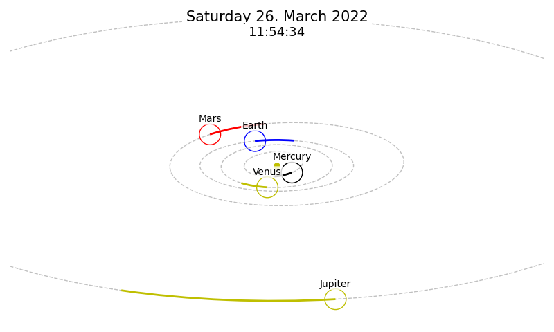

# solar_system
Plot orbits of planets in a Matplotlib-Canvas, either to create a picture or in an interactive window.

This project contains
  - Planet class with definition of orbital elements
    and methods for position calculation
  - planets file containg definitions of planets of our solar system
  - geometry package for projection of points and ellipsis
    onto planes
  - tkinter window app for plotting orbits and manipulating time and viewing angles
  - create_picture function to create png file with orbits for a 
    given time and viewing plane

## Example plot with the innermost four planets of the solar system
(Phi = -70, Psi = 0, Theta = 0, Zoom = 0.4)

